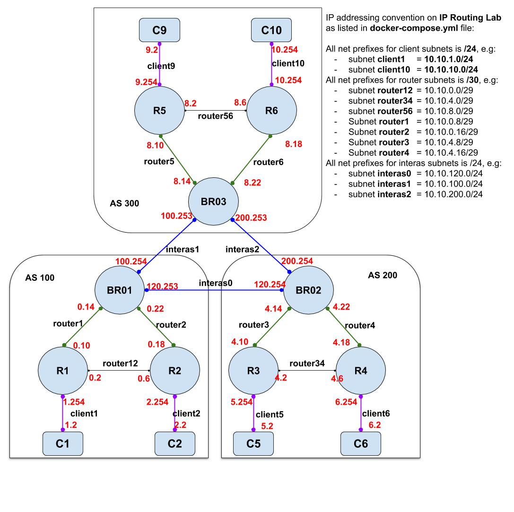

# IP Routing Lab

This IP Routing lab consists of 3 ASes where each AS has 3 routers and 2 clients using FRR docker image. Please refer to the topology when you are going to configure each router.

## Prerequisite

To build this IP routing lab, you need to install [Docker Desktop for Mac or Windows](https://www.docker.com/products/docker-desktop)

## Clone Repo & Run docker-compose

- Prepare a directory where you will clone this repo and do `git clone https://github.com/abazh/routing_lab.git`
   ***!!!Warning: if you are using WSL2, please clone or extract the files in the Linux file system directory: \\\wsl$\ and run everything from wsl !!!***
- Go to directory of the cloned repo 
- Run `docker-compose up -d` 
> This docker-compose command will generate all docker containers (6 clients and 9 routers)
> To stop or start the containers
- Run `docker-compose stop` or `docker-compose start`
> Remember, you need to reset gateway on each client and each router everytime after docker-compose up -d or docker-compose start. You can refer to the commands in [route_clean.sh](route_clean.sh) or [route_clean.ps1](route_clean.ps1) script 
- Run the script `route_clean.sh` or `route_clean.ps1` (windows powershell)

## Configure Routers:
> You can refer to the [Wiki](https://github.com/abazh/routing_lab/wiki) of this repository on how to configure each router.

There are 3 IGP routers, each with **ASN 100, 200, and 300**:
To access each router configuration console, you need to run a command in your PowerShell console or terminal console:
- `docker exec -it R1 vtysh`

To test routing between clients, you can do traceroute from each client
- `docker exec -it C1 traceroute -n C10`
> your result may look like:
- `traceroute to C10 (10.10.10.2), 30 hops max, 46 byte packets`
- `1  10.10.1.254  0.040 ms  0.033 ms  0.321 ms`
- `2  10.10.0.14  0.034 ms  1.636 ms  0.146 ms`
- `3  10.10.100.253  0.167 ms  0.123 ms  0.050 ms`
- `4  10.10.8.18  0.035 ms  0.126 ms  0.040 ms`
- `5  10.10.10.2  0.221 ms  0.043 ms  0.035 ms` 
 
